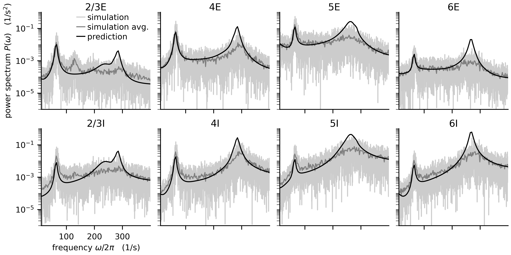
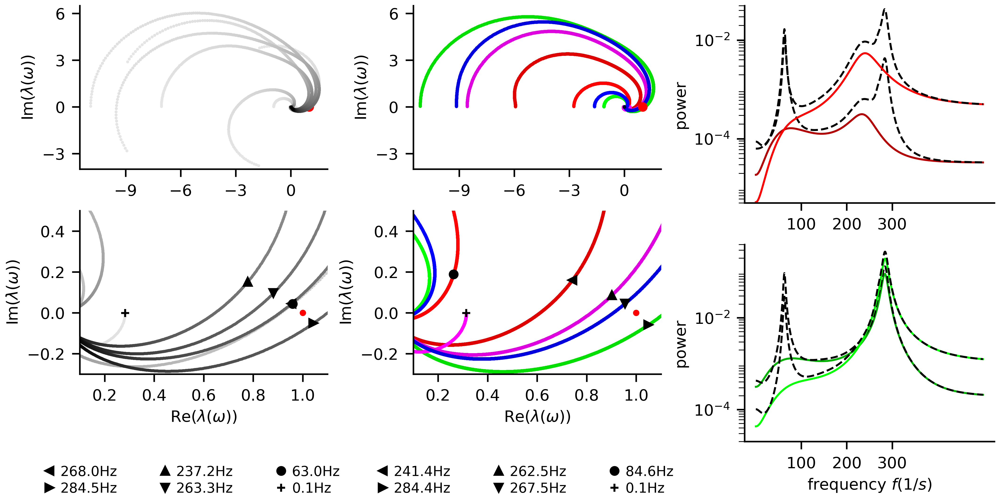
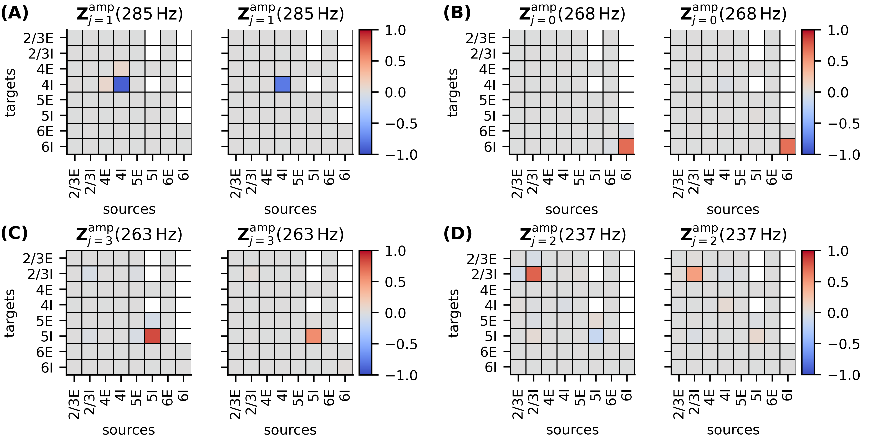
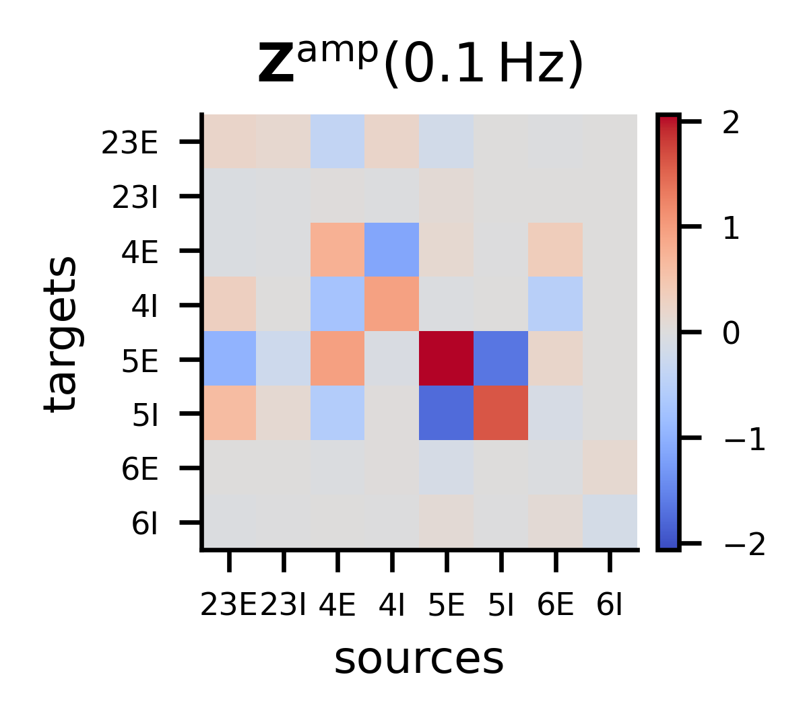
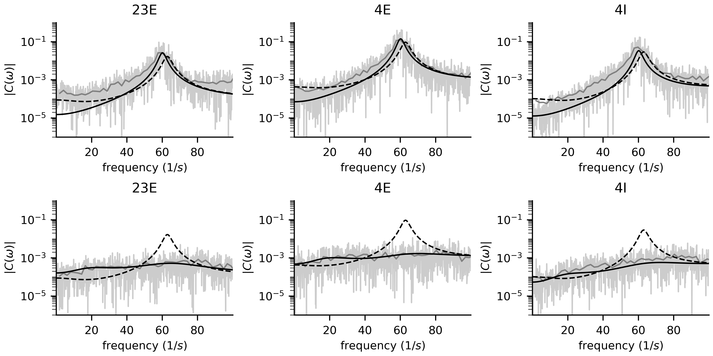

.. _example_bos_2016:

======================================================================
Power spectra and sensitivity measure in microcircuit model (Bos 2016)
======================================================================

These examples reproduce results by :cite:t:`bos2016`.

- :doc:`power_spectra.py <auto_examples/bos2016/power_spectra>`:
  plots the power spectra predicted by mean-field theory and compares it with
  simulation results (Fig 1E in :cite:t:`bos2016`)

- :doc:`eigenvalue_trajectories.py <auto_examples/bos2016/eigenvalue_trajectories>`:
  calculates the eigenvalues of the effective connectivity matrix across all
  analysis frequencies for the whole circuit and for the isolated layers
  (Fig. 4 in :cite:t:`bos2016`)

- :doc:`sensitivity_measure_high_gamma.py <auto_examples/bos2016/sensitivity_measure_high_gamma>`:
  computes the sensitivity measure for each eigenmode to reveal the anatomical origin
  of peaks in the power spectra (Fig. 6 in :cite:t:`bos2016`)

- :doc:`sensitivity_measure_low_gamma.py <auto_examples/bos2016/sensitivity_measure_low_gamma>`:
  computes the sensitivity measure and changes connectivity to reduce peak 
  in power spectra accordingly (parts of Fig. 5 and Fig .8 in :cite:t:`bos2016`)

- :doc:`power_spectra_of_subcircuits.py <auto_examples/bos2016/power_spectra_of_subcircuits>`:
  confirms the results of the sensitivity measure for the low-$\gamma$ oscillations by
  plotting the power spectra of the relevant subcircuits
  (Fig. 9 in :cite:t:`bos2016`)

All Python scripts use the parameter files
:download:`Bos2016_network_params.yaml <../../tests/fixtures/integration/config/Bos2016_network_params.yaml>`
and
:download:`Bos2016_analysis_params.yaml <../../tests/fixtures/integration/config/Bos2016_network_params.yaml>`.
