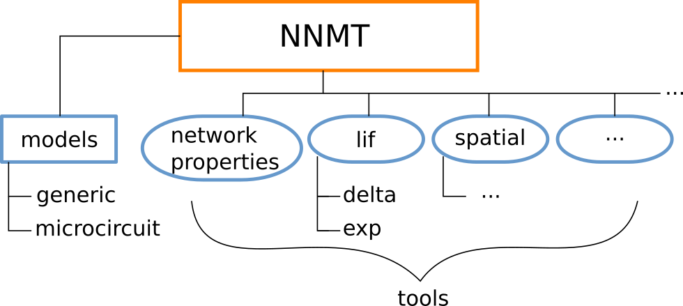

=================
Contributor guide
=================

Welcome! You are now entering the contributor guide. This place is for people
interested in the details needed to contribute to NNMT. We want this toolbox to
be a place for the Neuroscientific community to collect analytical methods for
neuronal network model analysis. So we are glad that you made your way here and
hope that you will find what you are looking for. Good luck and have a lot of
fun!

Contributions to our `GitHub repository <https://github.com/INM-6/nnmt>`_ can
be made via the GitHub fork and pull request workflow.

Any suggestions or problems should be reported as
`issues on GitHub <https://github.com/INM-6/nnmt/issues>`_.

***********************************
What belongs here and what does not
***********************************

Here we should give a detailed explanation of what we think should be part of
NNMT and what should not. But, as the toolbox is still in its infancy, this is
rather difficult to define. We do not know yet, how the toolbox might - or
should - develop in the future. At the moment we only can state the general
purpose of this package:

NNMT is a Python toolbox for collecting analytical methods for neuronal network
model analysis.

******************************************
Structure of toolbox and design principles
******************************************

Structure
=========

Design principles
=================

- all calculations are in SI units, without quantities (bare numbers), because
  one circumvents problems of quantitiy packages (like pint) in combination
  with special functions (erf, zetac, etc)
- the idea is to resuse as much code as possible. so if two functions in
  different submodules (like lif.exp and lif.delta) need the same function, it
  should be put into a higher order module (here _static (rename?)). If two
  submodules that need a similar function are not both part of the same
  submodule, it might be sensible to combine them in a new submodule
- think of the module's structure in a very flexible, non-dogmatic way. If the
  canonical split into neuron type, synapse type doesn't fit, feel free to
  adjust the submodule structure accordingly. An inspiration to us was the
  submodule structure of scipy, which (at least it seemed so to me) is rather
  free and fitted to the needs at hand.

Tools
=====

- the tools are ordered according to neuron and synapse type, because that
  seemed like the most sensible structure, starting off with LIF neurons
- the function doing the job is the underscored function; it gets all
  parameters as arguments directly
- to make a tool usable with the convenience layer (aka models), it gets a
  wrapper function (without the underscore)
- the wrapper function checks all parameters and results available
- the wrapper function invoces the _cache function
- should be using parameter checks (decorators in utils)
- should raise warnings if valid parameter regime is left
- should raise errors if return values are meaningless (negative rates)
- should have meaningful names
- need to have good docstring

Models
======

- models derive from the network class
- each model is supposed to calculate necessary parameters when instantiated
- therefore you can add methods and invoke them in the __init__ method.
- they might read in yaml files, specifying the model parameters including
  units.
- when instantiated the parameters are loaded, converted to SI units and then
  stripped off units saved in input_units dict
- result units stored in results_units
- most important: results hash dict vs results dict

Utils
=====

- most important: cache and how it works

*****
Tests
*****

- explained in detail in :ref:`test section <mytests>`

*************
Documentation
*************

- mostly automatic using sphinx and rst files
- source vs build
- conf.py
- index.rst
- make clean, make html
- link to sphinx documentation
- Need to list functions in module docstring
- follow numpy standard (link)
- in wrapper or underscored function?
- if in wrapper, you need to list the network params, analysis params and
  results needed