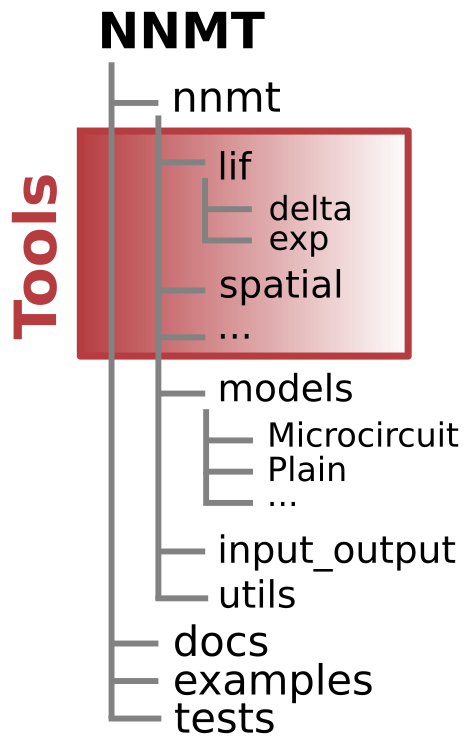

.. _sec_contributors_guide:

===================
Contributors' guide
===================

Welcome! You are now entering the contributors' guide. This page is for people
interested in the details needed to contribute to NNMT. We want this Python
toolbox to be a place for the Neuroscientific community to collect analytical
methods for neuronal network model analysis. So we are glad that you made your
way here and hope that you will find what you are looking for. Good luck and
have a lot of fun!

**********
Contact us
**********

Contributions to our `GitHub repository <https://github.com/INM-6/nnmt>`_ can
be made via the GitHub fork and pull request workflow.

Any concrete suggestions or problems should be reported as
`issues on GitHub <https://github.com/INM-6/nnmt/issues>`_.

**********************************
Setting up a developer environment
**********************************

Fork NNMT on `GitHub <https://github.com/INM-6/nnmt>`_ and download the source
code to your local machine:

.. code:: bash

  git clone git@github.com:<your-github-profile>/nnmt.git
  cd nnmt

Then you need to install the package and all requirements. We recommend using
`conda <https://docs.conda.io/en/latest/>`_ and the provided
``environment.yaml``:

.. code:: bash

  conda env create -f environment.yaml
  conda activate nnmt

Alternatively, you might install NNMT and its requirements in editable mode
using ``pip``:

.. code:: bash

  pip install -e .

After the installation, we recommend running the tests, which will take a few
minutes (see :ref:`sec_tests` for more details):

.. code:: bash

  pytest

If all tests pass (except for skipped tests), you should be ready to go.

***********************
Structure of repository
***********************

- ``nnmt`` is the Python package itself.

  - The submodule ``nnmt.models`` contains all the :ref:`models <sec_models>`.
  - The submodule ``nnmt.input_output`` contains
    :ref:`utility routines for input and output related tasks <sec_input_output>`.
  - The submodule ``nnmt.utils`` contains :ref:`helper functions <sec_utils>`
    used throughout the toolbox, like unit conversion functions, the cache
    function, or parameter checks.
  - All other submodules contain the :ref:`tools <sec_tools>`.

- ``docs`` contains the :ref:`documentation <subsec_docs>` files.
- ``examples`` contains all :ref:`example scripts <sec_examples>`.
- ``tests`` contains our :ref:`test suite <sec_tests>`.

*****************
Design principles
*****************

The best description of the ideas behind the design of the toolbox can be found
in our paper:

`NNMT: A mean-field toolbox for spiking neuronal network model analysis <add missing link>`_.

Here we collect some principles that should be followed when writing new code
for the toolbox:

- **All calculations are to be done in SI units.** We do not use Python
  quantity packages like ``pint`` or ``quantitites`` inside the actual
  calculations because this often causes problems in combination with special
  functions (e.g. ``erf`` or ``zetac`` from SciPy). Although we do use
  ``pint`` for converting parameters including units from yaml files to
  dictionaries. For more detail see the :ref:`models section <subsec models>`.
- **Resuse as much code as possible.** If two functions in
  different submodules (e.g. in ``lif.exp`` and ``lif.delta``) use the same
  function, the function should be put into a higher module at a higher level.
  In the ``lif`` module we introduced the ``_static`` module which serves this
  purpose. Keep in mind that if two modules that need a similar function are
  not both part of the same submodule, it might be sensible to combine them in
  a new submodule.
- **The package's structure is supposed to be adapted in a flexible,
  non-dogmatic way.** If the canonical split into neuron type, synapse type
  doesn't fit, feel free to adjust the submodule structure accordingly. An
  inspiration to us was the submodule structure of SciPy, which (at least
  it seemed so to us) is rather free and fitted to the needs at hand.

Tools
=====

Tools are **Python functions** and constitute the core of NNMT. They actually
perform the calculations.

We decided to **sort them into different submodules**. Originally, starting off
with tools for LIF neurons, we thought the most sensible split is according to
neuron type (e.g. LIF, binary, etc.) and then, if required, another split
according to synapse type (e.g. delta, exponential). But analytical theories of
neuronal network models are very versatile. Therefore other ways of sorting the
tools might be more appropriate for different tools.

It is vital that all tools have **meaningful names** and
**comprehensive docstrings** (see :ref:`documentation section <subsec_docs>`
for more details).

If you make any well-thought-out decisions in the implementation of a tool, for
example for optimization purposes, you need to **write comments** that clearly
state the reasons for you to do so. Otherwise, someone else might come across
your lines of code a few years later and change it, because it looked
unnecessarily cumbersome at first sight, thereby destroying all your precious
efforts.

_Tools
******

Tools with an underscore are where the job is done. Underscored tools should

- **get** all **parameters** needed for a calculation **directly as**
  **arguments**.
- **perform the calculations**.
- **assert** that all arguments have **valid values**. For example, they need
  to check whether parameters that only should be positive are negative. You
  could use the check decorators defined in :mod:`nnmt.utils` for this.
- **raise warnings if valid parameter regime is left**. For example if the
  assumptions made in the underlying theory are not fulfilled by the
  parameters.
- **raise errors if return values are meaningless**, for example if negative
  rates would be returned.

Have a look at the source code of :func:`nnmt.lif.exp._firing_rate_shift` if
you would like to see an example.

Wrappers
********

To make an underscored tool compatible with the convience layer, a.k.a. models,
it gets a wrapper withouth an underscore. The non underscored wrappers should

- **expect an** ``nnmt.model`` **as argument**.
- **check** that all **parameters and results needed are stored in the model**.
- invoces the :func:`nnmt.utils._cache` function to **store the results** in
  the model instance.

Have a look at the source code of :func:`nnmt.lif.exp.firing_rates` if you
would like to see an example.

.. _subsec models:

Models
======

Models are Python classes that serve as containers for network parameters,
analysis parameters, and results. They come with some convenience methods for
changing parameters, saving, and loading results.

Typically, one wants to define parameters in some sort of parameter file (we
usually use ``yaml`` files for this), load them, and then calculate further,
dependent parameters from these. The details of how these dependent parameters
are calculated depend on the model that one is planning to investigate.
Defining a custom model class allows users to do this in a very organized
setting.

A model should

- **be a subclass of** the generic :class:`nnmt.models.Network` class and
  invoke the parent ``__init__()`` method. The model's ``__init__()`` method
  should start with

  .. code::

      def __init__(self, network_params=None, analysis_params=None, file=None):
          super().__init__(network_params, analysis_params, file)

- **implement the** ``_instantiate()`` **method**:

  .. code:: python

      def _instantiate(self, new_network_params, new_analysis_params):
          return <MyModel>(new_network_params, new_analysis_params)

  ``_instantiate()`` is invoked when ``<MyModel>.change_parameters()`` is
  called and a new instance of the model is created.
- **calculate dependent parameters** when instantiated. For that purpose, you
  can add methods to your subclass and call them in the ``__init__()`` method.
  **Note that** if you use ``yaml`` files to store parameters including units,
  the **loaded parameters are**
  `Pint <https://pint.readthedocs.io/en/stable/>`_
  ``Quantity`` objects at this point. You might run into problems if imported
  functions from different packages are not compatible with ``Quantity``
  objects.
- **call** ``self._convert_param_dicts_to_base_units_and_strip_units()`` at the
  end of the ``__init__()`` method. This will convert all calculated parameters
  to SI units, strip the respective units off, and store them in the dictionary
  ``input_units``.

The microcircuit model :class:`nnmt.models.Microcircuit` is a good example of
how a model class looks like.

If you would like to add your model to ``nnmt.models``, do not forget to add

.. code::

    from .<my_model_module> import *

to ``nnmt.models.__init__.py``.

Input and output functions
==========================

The submodule :mod:`nnmt.input_output` contains all functions which called for
all input output related actions, like saving and loading results, or loading
parameter files.

We have written a very basic wrapper which allows storing and loading Python
dictionaries in ``HDF5`` files.

Similarly, we have written wrappers which allow loading dictionaries of Pint
``Quantity`` objects as ``yaml`` files and vice versa.

Utility functions
=================

The submodule :mod:`nnmt.utils` is a collection of convenient functions used
frequently throughout NNMT.

There you find the :func:`nnmt.utils._cache` function, which is called by the
wrappers of the underscored tools. It stores the results returned by a
underscored tool in the result related dictionaries of the model that was
passed to the wrapper. If you are looking for an example of how to apply the
``_cache`` function have a look at the source code of
:func:`nnmt.lif.exp.firing_rates`.

The module contains some decorators used to check that parameters passed to a
_tool have valid values. E.g. :func:`nnmt.utils._check_positive_params` or
:func:`nnmt.utils._check_k_in_fast_synaptic_regime`.

Finally, it contains some utility functions for handling Pint ``Quantity``
objects.

*****
Tests
*****

All tools, models, and utilities should be tested using our ``pytest`` test
suite. We have collected all the details in the section about
:ref:`Tests <sec_tests>`.

.. _subsec_docs:

*************
Documentation
*************

We automatically create this documentation using
`Sphinx <https://sublime-and-sphinx-guide.readthedocs.io/en/latest/index.html>`_.
Sphinx collects all the docstrings and the ``rst`` files in
``nnmt/docs/source/`` and creates these beautiful documentation ``html`` files.

Compiling the docs
==================

In order to compile the documentation, you have to change your working
directory to ``nnmt/`` and install and activate the provided conda environment

.. code:: bash

  conda env create -f environment.yaml
  conda activate nnmt

Change you working directory to ``nnmt/docs/`` and run the following commands

.. code:: bash

  make clean
  make html

This will compile the documentation and create the folder ``build/``.
Now you can access the documentation using your preferred browser by opening
the file ``build/html/index.html``.

Special files
=============

``nnmt/docs/source/conf.py`` defines all the Sphinx configurations, which
extensions are used, and details about the html output.

``nnmt/docs/source/index.rst`` configures the access page to the documentation.

rst files
=========

Everything you see in this documentation that is not part of a docstring is
written in the ``rst`` files in ``nnmt/docs/source/``.

Docstrings
==========

We try to follow the
`PEP 8 standard <https://www.python.org/dev/peps/pep-0008/>`_ and the
`NumPy docstring conventions <https://numpydoc.readthedocs.io/en/latest/format.html>`_
as close as possible.

Dosctrings should be written using
`rst syntax <https://docutils.sourceforge.io/rst.html>`_, which allows
cross-references and citations.

Modules
*******

Each module needs to start with its own docstring, beginning with a short
description of its content, followed by a list of the functions which are to be
shown in the documentation. The functions can be divided by different headings,
followed by an Sphinx autosummary directive. A generic example of such a
docstring would be

.. code::

    '''
    This module contains functions for doing awesome things.

    My Favorites
    ************

    .. autosummary::
        :toctree: _toctree/my_module/

        function1
        function2

    '''

Functions
*********

Wrappers of _tools should reference the respective _tools.

The docstrings of _tools should give a detailed explanation of all their
arguments.

**********
Versioning
**********

We follow `Semantic Versioning <https://semver.org/>`_. To cite the linked
page:

Given a version number MAJOR.MINOR.PATCH, increment the:

1. MAJOR version when you make incompatible API changes,
2. MINOR version when you add functionality in a backwards compatible manner,
   and
3. PATCH version when you make backwards compatible bug fixes.

Before releasing a new version, the version number should be updated in

- ``setup.py``,
- ``nnmt/__init__.py``, and
- ``nnmt/docs/source/conf.py``,

a :ref:`release note <sec_release_notes>` should be added, and the list of
:ref:`authors and contributors <sec_authors_and_contributors>`, as well as the
:ref:`acknowledgements <sec_acknowledgements>` should be updated if required.

