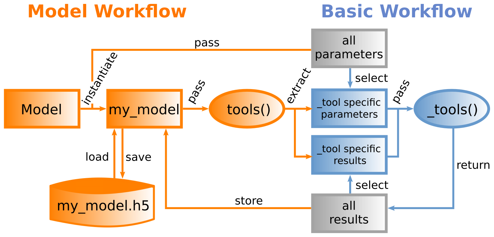

.. _sec_overview:

========
Overview
========

NNMT can be used in two different ways: the basic workflow or the model
workflow.

**************
Basic workflow
**************

The core of NNMT are the various implemented analytical methods for neuronal
network model analysis. The simplest way to use those methods is to select one
of the :ref:`available Tools <sec_tools>` and use the corresponding
**underscored function** or **_tool**. Those _tools take all required
parameters directly as arguments for computing the desired results. This
lightweight approach gives you full flexibility.

For example, calculating the firing rate for a random network of leaky
integrate-and-fire neurons with exponential synapses can be done using
:func:`nnmt.lif.exp._firing_rates`:

.. code:: python

    rates = nnmt.lif.exp._firing_rates(J, K, V_0_rel, V_th_rel,
                                       tau_m, tau_r, tau_s,
                                       J_ext, K_ext, nu_ext)

However, certain _tools require a large number of inputs, which can make
working with them a little cumbersome. To simplify their usage and support
users unfamiliar with the underlying theory, we developed the more convenient
model workflow.

**************
Model workflow
**************

Instead of passing the required arguments directly to the respective _tools,
one can instantiate a :ref:`Model <sec_models>` and pass it to the
corresponding **non-underscored wrapper** or **tool**.

Models basically are containers for network parameters, analysis parameters,
and results, with methods for changing parameters, saving, and loading results.
On instantiation they read in network and analysis parameters from dictionaries
or ``yaml`` files, calculate further depenend parameters from those, and
convert all parameters to SI units. *Network parameters* are all parameters
that describe properties of the network itself, like for example the number of
neurons in each population or the membrane time constants. *Analysis*
*parameters* are all parameters that do not describe properties of the network
but need to be defined in order to calculate quantities of interest. For
example, one needs to define the frequencies for which to calculate a frequency
dependent quantity.

When you call a tool, it tries to extract the parameters needed by the wrapped
_tool. If you are missing some parameters for applying the tool you would like
to use, you will receive an error message telling you which parameters you
still need to define:

.. code:: console

    RuntimeError: You are missing 'tau_m' for calculating the firing rate!
    Have a look into the documentation for more details on 'lif' parameters.

Sometimes, before you can calculate a quantity, you first have to calculate
something else. If you did not perform the relevant computation previously, you
will also receive an error message:

.. code:: console

    RuntimeError: You first need to calculate 'lif.exp.effective_connectivity'.

Once all arguments needed are available, the tools passes them to the wrapped
_tool, which calculates the result. Finally, the tool stores the computed
result in your models ``results`` dictionary and returns the result. If you try
to compute the same quantity repeatedly with identical parameters, a tool will
detect this and return the cached result instead.

Returning to the firing rate example from above, we can conduct the same
computation with :func:`nnmt.lif.exp.firing_rates` and a
:class:`nnmt.models.Basic` model:

.. code:: python

    network = nnmt.models.Basic('network_params.yaml')
    rates = nnmt.lif.exp.firing_rates(network)

where we defined the respective parameters in ``yaml`` files in the following
format:

.. code:: yaml

    # number of neurons in each population
    N:
      - 1000
      - 2000

    # membrane tim constant
    tau_m:
      val: 10
      unit: ms

    # external input
    nu_ext:
      val:
        - 1
        - 2
      unit: Hz

    ...

*****************
Package structure
*****************

.. image:: images/directory_structure.png
  :width: 200
  :alt: Sketch of structure of python package

In the submodule :ref:`nnmt.models <sec_models>` you can find all models as well as the generic
:class:`nnmt.models.Network` class, which all models are derived from.

:mod:`nnmt.input_output` contains helper routines for input and output related
tasks, including a basic wrapper of the ``h5py`` package, which allows you to
store and load dictionaries in ``h5`` files.

:mod:`nnmt.utils` contains utility routines, primarily for tool developers,
although some of the functions may be useful for regular users as well, such as
:func:`nnmt.utils._convert_to_si_and_strip_units`.

All other submodules, like :ref:`nnmt.lif <sec_lif>` and :mod:`nnmt.network_properties`
contain the tools.

Note that we have a bunch of nice :ref:`examples <sec_examples>`, as well as an
extensive :ref:`test suite <sec_tests>`, and a
:ref:`contributors' guide <sec_contributors_guide>` with further information on
the toolbox.